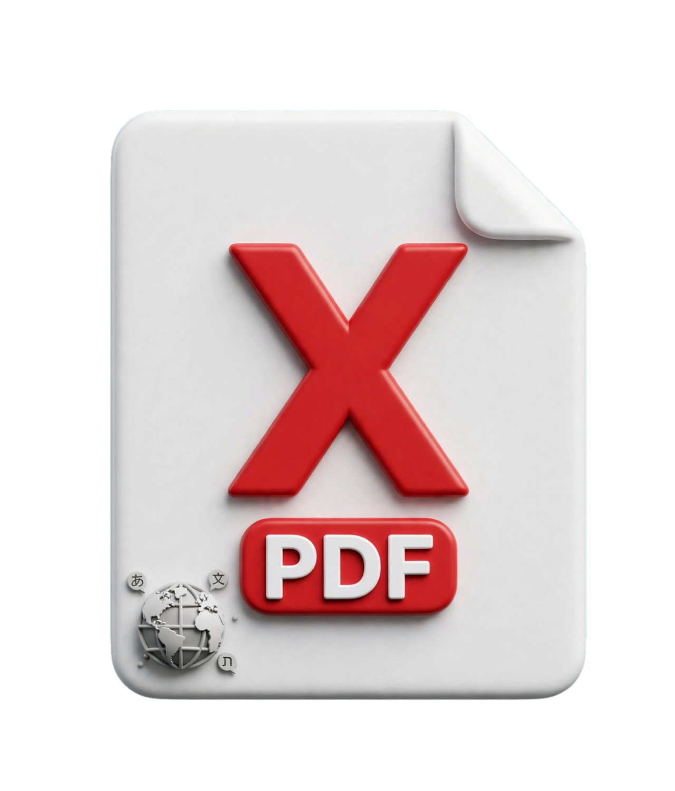

# 🚀 PDF X - High-Performance Document & Sheet Viewer

<p align="center">
  
</p>

**PDF X** is an ultra-fast, lightweight, production-ready Flutter application built for seamless viewing, parsing, and management of PDF documents and Excel spreadsheets (`.xlsx` / `.xls`).

Engineered with performance-first architecture, **PDF X** combines native processing power with advanced UI rendering to deliver near-instant launch times and an ultra-compact binary footprint **(~30 MB)**.

---

## 📱 App Screenshots

<p align="center">
  
  
  
  
</p>

---

## 👤 Developer Profile & Contact

* **Developer Name:** Yahia Emad (يحيى عماد)
* **Phone / WhatsApp:** [+20 155 342 7179](https://wa.me/201553427179)
* **Specialization:** Mobile Software Engineering (Flutter & Native Android Integration)

---

## ✨ Key Features & Highlights

### ⚡ Ultra-Fast Performance & Compact Size
- **Blazing Fast Startup:** Instant launch and rendering with zero lag or render blocking.
- **Optimized Binary Size:** Leverages `--split-per-abi` architecture targeting `arm64-v8a` to reduce APK footprint down to **~30 MB**.
- **Memory Optimized:** Efficient resource management ensuring stable performance without crash-on-launch issues under high load.

### 📄 Advanced PDF & Document Engine
- **Instant PDF Rendering:** Smooth page navigation, zooming, and high-resolution rendering powered by `pdfx` and native views.
- **On-Device OCR Capabilities:** Integrated Google ML Kit Text Recognition for intelligent text processing on-device.

### 📊 Excel & Spreadsheet Integration
- **Direct Excel Parsing:** Native parsing and multi-tab rendering for modern `.xlsx` sheets using structured data tables.
- **Legacy Format Support:** Intelligent external fallback system for legacy `.xls` files.

### 🌍 Comprehensive Localization (7 Languages)
Full dynamic multi-language localization system supporting seamless switching across 7 languages with right-to-left (RTL) and left-to-right (LTR) UI alignment:
- 🇪🇬 **Arabic** (العربية)
- 🇺🇸 **English**
- 🇫🇷 **French** (Français)
- 🇪🇸 **Spanish** (Español)
- 🇩🇪 **German** (Deutsch)
- 🇷🇺 **Russian** (Русский)
- 🇨🇳 **Chinese** (中文)

---

## 🛠️ Tech Stack & Architecture

- **Framework:** Flutter (Dart SDK >= 3.2.0)
- **Architecture:** Clean Modular UI/Logic Isolation (`main.dart` -> `ui.dart`)
- **Key Dependencies:**
    - `pdfx` & `flutter_pdfview` - Native PDF rendering engines
    - `excel` - High-performance spreadsheet parser
    - `google_mlkit_text_recognition` - On-Device Machine Learning OCR
    - `flutter_localizations` & `intl` - Multi-language translation engine
    - `open_filex` & `share_plus` - System-level file invocation & sharing handlers

---

## 🚀 Building & Deployment

### Run Locally
```bash
flutter pub get
flutter run